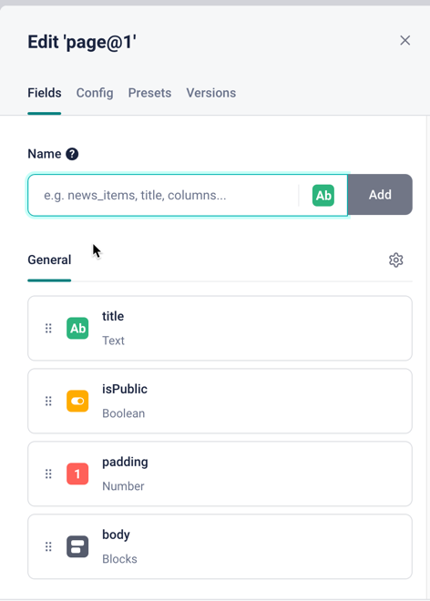
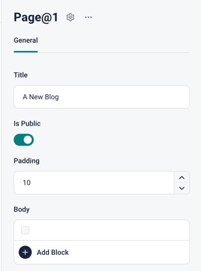
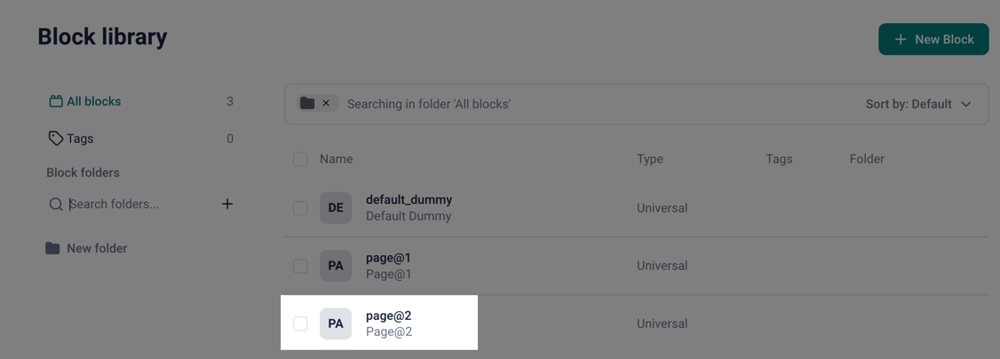
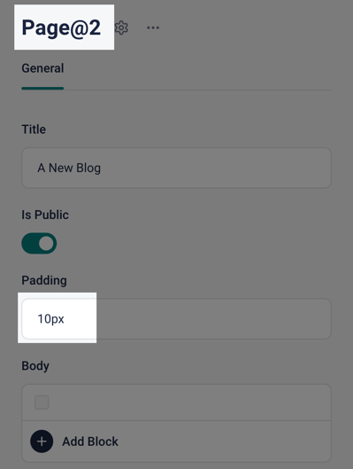

# `@johannes-lindgren` Storyblok POCs

Proof of concepts for Storyblok libraries:

- Strict type safety with Storyblok
- Content parsing
- Components as code
- Generating parsers from components
- Inferring types from components
- Migrations

## Examples

In this repository, you will find a few examples:

### Manual Types

Directory: `examples/manual-types`

In this example, you manually define type aliases and components in Storyblok UI that matche each other.

Finally, with the help of [PureParse](https://www.npmjs.com/package/pure-parse), you can easily construct parsers for your content in a type-safe manner.

#### Questions

- Should it handle field-level translations? In case we don not want the Delivery API to do so for us.
- Should it resolve references? In case we do not want this to be handled by a separate tool.

### Configuration as Code

Directory: `examples/configuration-as-code`

In this example, you define your components in code which you:

- push to Storyblok
- generate parsers from
- infer types from

Magic!

### Migrations

Directory: `examples/migrations`

Over time, your component library might evolve. By defining components in code, you can easily retain the entire version history. But once the components have been updated, the challenge becomes to migrate your components.

The migration example demonstrates how you can migrate content from one version to another by making use of the parsers from the previous examples.

There are two scripts:

- `start:0` initializes your space with some example content and an initial state of your component library.
- `start:1` updates the component library by changing a number field (of pixel values) to a string field (to a style length attribute value).

Initially, you start out with one component and one story:

After migration (`start:1`), you get a new component that represents an updated version:

And the content is migrated:

